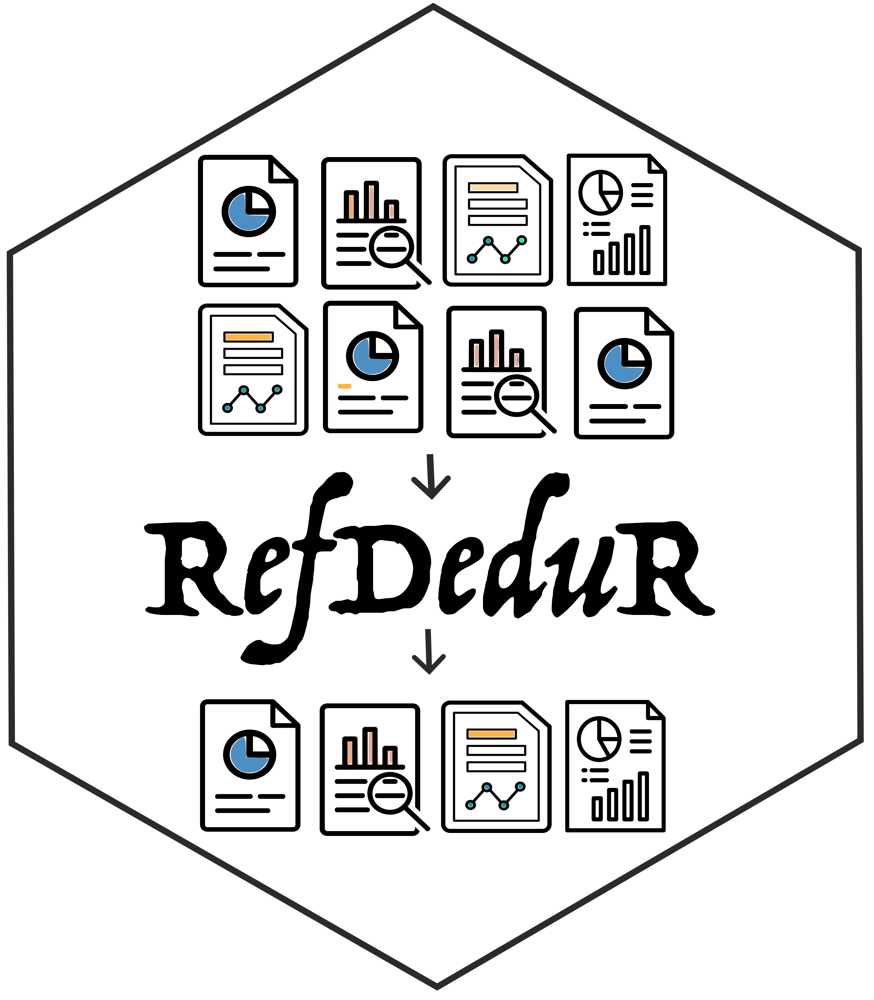

<!-- README.md is generated from README.Rmd. Please edit that file -->

# RefDeduR <a href=''></a>

[](https://github.com/rossellhayes/ipa/actions)
[](https://cran.r-project.org/web/licenses/GPL3.0)
[](https://github.com/jxshen311/RefDeduR)

RefDeduR is an R package that supports accurate and high-throughput
reference deduplication. It is especially useful for large datasets and
operates on standard bibliographic information (i.e., it does not
require information that cannot be retrieved from a mainstream search
engine such as PMID).

The deduplication pipeline is modularized into finely-tuned text
normalization, three-step exact matching, and two-step fuzzy matching
processes. The package features a decision-tree algorithm and considers
preprints and conference proceedings when they co-exist with a
peer-reviewed version.

## Author

Jiaxian Shen

Department of Civil and Environmental Engineering, Northwestern
University

[](https://twitter.com/shen_jiaxian)

## Installation

You can install RefDeduR from [GitHub](https://github.com/) with:

``` r
# install.packages("devtools")
devtools::install_github("jxshen311/RefDeduR")
```

## Tutorial, website and publication

-   For a step-by-step tutorial with an example dataset, see
    <https://jxshen311.github.io/RefDeduR/articles/RefDeduR_tutorial.html>.

-   For a complete introduction, check out the website:
    <https://jxshen311.github.io/RefDeduR/>.

-   For more information, check out the preprint on bioRxiv:
    <https://www.biorxiv.org/content/10.1101/2022.09.29.510210v1>.

## Citation

If you use RefDeduR, please cite:
<https://www.biorxiv.org/content/10.1101/2022.09.29.510210v1>

## Acknowledgement

We thank Yutong Wu for the illuminating discussions about the design of
RefDeduR. We are also grateful to Ruochen Jiao and Alexander G.
McFarland for their help in coding.

We thank Ahmad Roaayala, Eko Purnomo, and Vectors Point from Noun
Project for allowing us to use the following icons [Research
Paper](https://thenounproject.com/icon/research-paper-3587992/), [Report
Paper](https://thenounproject.com/icon/report-paper-3587986/),
[report](https://thenounproject.com/icon/report-4520807/), and [Stats
Report](https://thenounproject.com/icon/stats-report-3262083/) to create
the logo.
